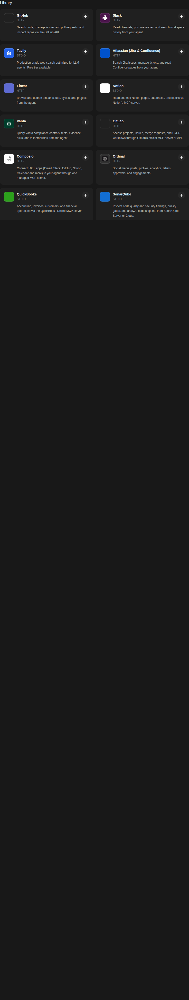

# Openhands-composio

Composio integration for OpenHands / Agent Canvas — inspection, fixes, and the
upstream contribution.



## What's here

| Path | Purpose |
|---|---|
| [`docs/INSPECTION.md`](docs/INSPECTION.md) | Full inspection report: what the integration is, architecture, what needed fixing, verification |
| [`docs/PR_UPSTREAM.md`](docs/PR_UPSTREAM.md) | The PR opened to `OpenHands/extensions` |
| `integrations/catalog/composio.json` | Schema-valid marketplace catalog entry |
| `integrations/icons/composio.svg` | Composio mark (from official brand assets), black on white |
| `scripts/patch-local-canvas.sh` | Idempotent, reversible patch for a deployed Agent Canvas |
| `assets/` | Screenshots of the working result |

## The short version

The Composio integration is Composio's hosted MCP server
(`https://connect.composio.dev/mcp`, header auth `x-consumer-api-key`). It
worked, but Agent Canvas's integration catalog had no Composio entry, so the
marketplace showed a generic puzzle icon and Composio couldn't be added from
the UI.

This repo fixes that locally (see `scripts/patch-local-canvas.sh`) and proposes
the fix upstream (`OpenHands/extensions`).

## Applying locally

```bash
# patches the installed @openhands/extensions package AND the built frontend
# bundle (the catalog is inlined at build time). Keeps .bak-composio backups.
./scripts/patch-local-canvas.sh
```

Rollback: `cp <file>.bak-composio <file>` for each patched file.

## Upstream

The catalog entry + icon are proposed in
`OpenHands/extensions` — see [`docs/PR_UPSTREAM.md`](docs/PR_UPSTREAM.md).

Icon source: official Composio brand assets (composio.dev), mark-only, re-centered.
